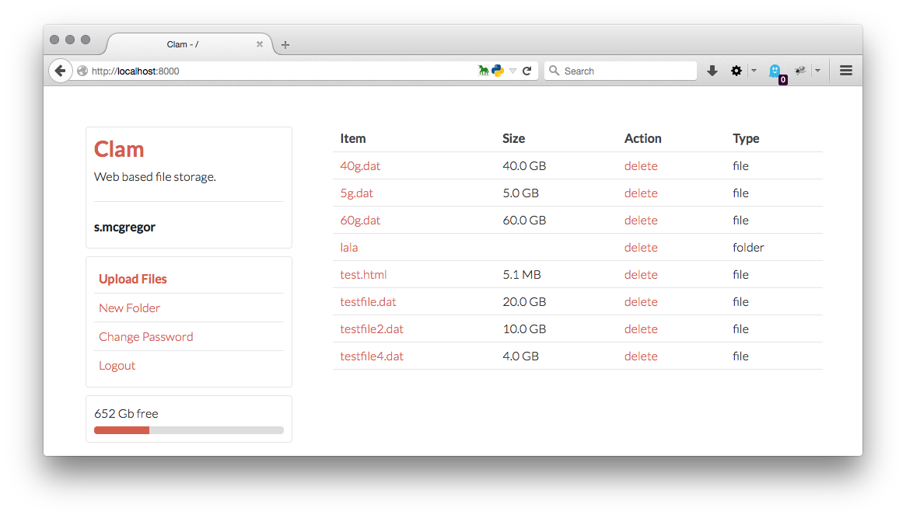

Clam
=======

Clam is a basic web filesystem. Allowing for listing of directories, uploading and downloading of files.

Clam is written in Python, and has **no external requirements** to run, however we recommend you use [gunicorn](http://gunicorn.org/) for multi user installs. 

*A gunicorn configuration file is provided in gunicorn_config.py*

## Plugins ##

Due to the modular nature of Clam you can overwrite or extend 3 core elements without modification to the core program. It may be important to note that there is a *children* attribute meta appended to every class, probably don't touch this at runtime unless you are deregistering another plugin live.

### Filesystem ###

The default filesystem works off of a directory structure of `/data/<username>/files/`, it allows for uploading/downloading of files as well as creation of directories and deletion of both. A filesystem plugin must consist of the following:

The filesystem is in theory a chrooted filesystem for the particular username given upon creation at load time, as such it is important that plugins make sure to protect against directory traversal when handling user requests.

Each file returned in the directory listing method must provide a list of actions that can be taken on the file, this list may be empty. Each one of these actions returned will append a link consisting of `&<action>=true` to the url, these requests are then passed back to any methods within *all* filesystem plugins that define an `action_<action>` method. An example is shown below.

    class examplefs(filesystem):
    
    ...
    
    def directory_read(self):
        return [{
			'isdir': False, 
			'name': 'MEOW.dat',
			'file': 'example.dat',	
			'size': '100 GB', 
			'path': '', 
			'actions': ["customact"],
		}]
        
    def action_customact(self, filename):
        """Implement whatever function should be taken in here, 
        a great example is action_delete in default_fs.py
        """
        pass
        
    ...

Look at `plugins/default_fs.py` for more information about how to create a filesystem plugin.

### Session ###

The default session handler is set to use cookies, this should be acceptable to most installs. In the event another session provider is required a example session plugin can be seen below. 

Three important methods exist for creating a session, expiring and retrieving the session. In the event there are multiple session plugins loaded the application will simply take the last returned value. Your plugin should not return any value if it cannot verify a users session in the event another plugin is able to.

    class randomsession(session):
    	"""Production ready session handler"""

		def __init__(self, request):
			self.req = request # a request object, used to modify headers/cookies

		def set(self, username, expires=None):
			return True

		def expire(self):
            pass # You can never leave

		def get(self):
            if random.randint(0, 4):
			    return 'admin'
                
### Authentication ###

Authentication is something every approaches differently, as such creating an authentication plugin is as easy as possible. It is required to check a password, and set a password (*and setting can just pass-through*)

As such an extremely basic authentication plugin is provided below. A not much better example is available withing `plugins/default_auth.py`, it is extremely minimal and avoids the use of any database calls. I cannot recommend it's use in a production environment.

    class myauthplugin(authentication):

		def __init__(self, username):
			self.username = username

		def password_verify(self, password):
			return self.username == password # lets keep things simple

		def password_set(self, password):
			pass